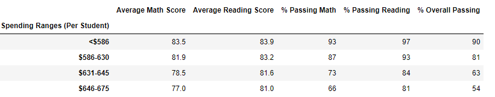
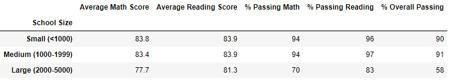
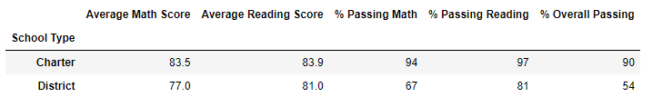

# School_District_Analysis

## Overview of the school district analysis: 

This project analyzes district school data regarding reading and math tests in order to get relevant insights about performance trends and oputputs. The analysis seeks to assist school board in making decisions regarding the school budget and priorities.

The project consists in two analysis, the first one takes into account all of the avilable data. However the second analysis excludes the results of 9th grade students at Thomas High School as there are suspicions of academic disshonesty. Therefore the second analysis was run without taking into consideration the results of this group.

The main deliverables for our client were a district summary and a school summary that contained all of the information needed for them to make informed decisions. In this report we are going to compare the results of the two analysis made (one with all students and the other excluding 9th grade High School students)

## Results: 

In this part of the analysis we will discuss the main results obtained from both analysis.

* How is the district summary affected?

The district summary shows the results of the math and reading tests performance of all the schools in the district as well as the total budget. 
The results from the first analysis are shown below:

The results from the second analysis are shown next:

From the previous images, we can conclude that the number of total students, schools and budget remained the same. This is because eventhough the second analysis does not take into account the results from 9th grade Thomas High Students in math and reading, they are still considered part of the school and do not affect the school budget as well. However it does affect math results as it decreases the average score from 79 to 78.9, and the % of passing math also decreases from 75% to 74.8%. Average reading score is unaffected, but the percentage of passing reading slightly decreased, from 85.8 % to 85.7%. Laslty, we can see that the overal percentage of passing also decreased from 65.2% to 64.9%.  In general, results show a very slight variation in the district performance but it still affects.

* How is the school summary affected?

As what was expected the only school which results were affected was Thomas High School. However the results did not have a very significant impact. 
The school type, total students, total school budget and per student budget metrics remained the same for both analysis. The rest of the metrics did change a little.     * The avergae math score decreased from 83.42 to 83.35.  
  * Average reading score increased from 83.84 to 83.90.
  * % Passing math decreased from 93.27 yo 93.19.
  * % Passing reading decreased from 97.31 yo 97.02.
  * %Overall passing decreased from 90.95 to 90.63.
  
 In order to appreciate this changes the images below show the results for both analysis:

## Original School Summary 

## Modified School Summary

* How does replacing the ninth graders’ math and reading scores affect Thomas High School’s performance relative to the other schools?

Although some of the metrics decreased their value compared to the original results it did not affect the performance of Thomas High School relative to other schools. Thomas High School maintains its second place in both analysis.This can be shown with the next images.

## Original Top Schools

## Modified Top Schools

* How does replacing the ninth-grade scores affect the following:
 
    *Math and reading scores by grade
    There was no significant change rather that in the second analysis, in 9th grade for Thomas High School instead of having a numerica value it appears with nan.
    This same effect is presented in both math and reading, but the rest of the values for the table remained the same.
    
    * Scores by school spending

    
    
    
    * Scores by school size
    
    

    

    

    * Scores by school type
    
    
    
    

## Summary: Summarize four changes in the updated school district analysis after reading and math scores for the ninth grade at Thomas High School have been replaced with NaNs.
s
